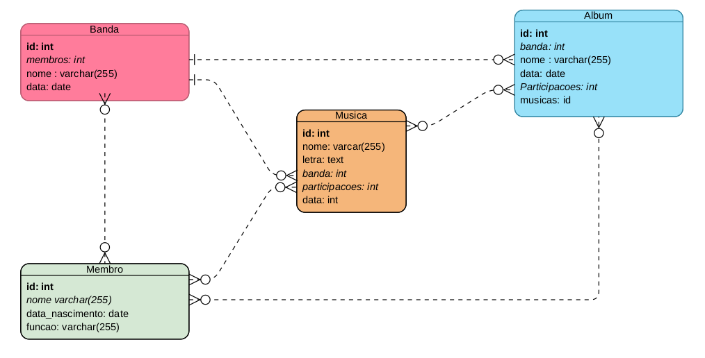

# MUSICAPI
A MusicAPI é uma API para o cadastro de músicas e discografia, ela tem como objetivo o armazenamento e disponibilização de dados sobre músicas de diferentes cantores e bandas.
# Requisitos
python>=3.8
# Instalação
### Configurando o seu ambiente
```bash
python -m venv venv
source venv/bin/activate
pip install -r requirements.txt
```
### Criando um SECRET_KEY
O Django usa a SECRET_KEY para gerenciar algumas issues de segurança na nossa aplicação. Por exemplo, o Django faz a criptografia das senhas dos usuários baseado também na SECRET_KEY, cria aquelas URLs únicas de reset da senha do usuário, além de outras coisinhas na sessão, cookie e etc. 
**Então o recomendado é nunca expor ela.**

A um script criado para gerar uma nova para você sem muitas preocupações.
```
python generate_secret_key.py
```
### Iniciando um servidor local
```bash
python manage.py runserver
```
### Criando super usuários
```bash
python manage.py createsuperuser
```
Para acessar é só entrar no [localhost](http://127.0.0.1:8000/) da sua maquina.
# Arquitetura


A entidade User é a nativa do Django e conta com 3 endpoints disponibilizados:

1. user-create -> Aqui você pode criar um usuario simples para acessar a API.
2. user-detail -> Aqui você pode visualizar dados do seu usuário logado e também alterar ou deletar.
3. adminuser-create -> Aqui você pode criar um super usuário, mas para acessar você precisa está logado como um super usuário.

# Disponibilização
A API já pode ser encontrada no [endereço](https://musicbr-api.herokuapp.com/), na página inicial você vai encontrar uma documentação swagger, mas você pode escontrar a documentação no [link](https://musicbr-api.herokuapp.com/redoc/).

